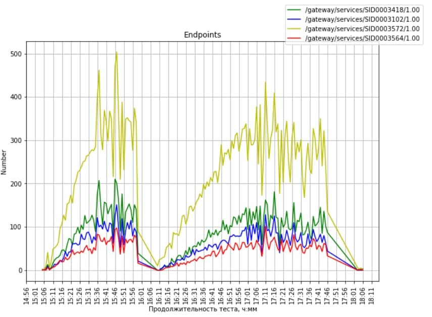
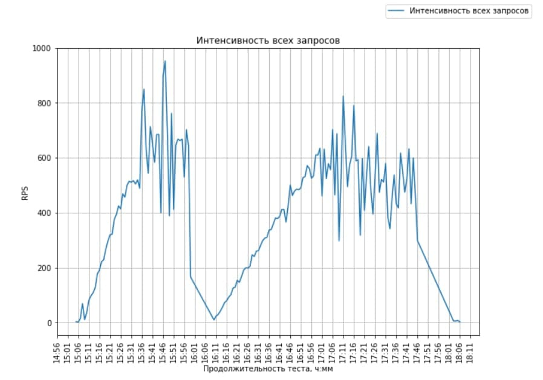

# PythonGraphs 
PythonGraphs is an application written on python. The main goal of this app is to create graphs using sar log file. 
The default file is sar_mpgu_izh.csv.

First of all, to use it you need to install some packages using pip

```bash
install anaconda
```

## Graphs
This app creates 3 graphs based on sar.log file: Average RPS per minute, average passed and failed requests & average rps per endpoints


#To check click: [](https://mybinder.org/v2/gh/gorbovlesha/PyGraphs2Step/HEAD)


## Examples:


